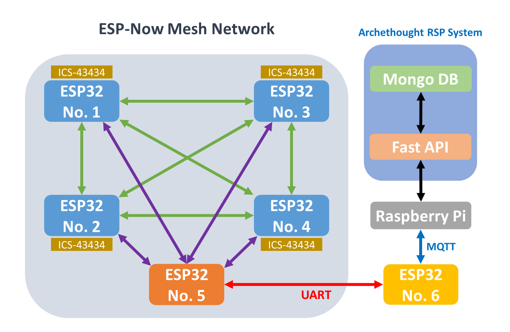

<dev align="center">
<h3 align="center">City Mesh-Network of IoT</h3>
 

  <h5>New York Institute of Technology</h5>
   
  <h6>Po Ling Huang, Hsin Tzu Lai, Jimmy Qian</h6>
  <h6>Professor: Sara Khanchi</h6>

</dev>
# Abstract
This project introduces a state-of-the-art IoT solution for real-time sound monitoring in smart cities. It utilizes ESP32 microcontrollers to create the mesh network for seamless data collection, analysis, and transmission, connecting to cloud services via Raspberry Pi. The system employs an ESP-Now mesh network for robust communication over long distances, crucial for urban IoT applications.

In addition to sound sensor data, the project utilizes advanced signal processing techniques like IIR filtering and the A-Weight algorithm for accurate noise level interpretation. This enables the system to identify sound patterns and extract valuable insights, essential for smart city infrastructure.

However, the project faces challenges due to the newness of ESP-Now technology, impacting adoption and technical support. Integrating diverse communication protocols like ESP-Now, UART, and MQTT adds complexity, requiring careful configuration for stable data flows. Despite these hurdles, the project showcases the potential of ESP32 and Raspberry Pi in long-distance IoT communication, highlighting their scalability and effectiveness in smart city contexts.

## Tools

ESP32-DevKitC-DA ESP32-WROOM-DA Wi-Fi

ICS-43434

## Structure Diagram

## Methodology
Welcome to the methodology section of our project, where we delve into the intricacies of validating a cutting-edge solution for real-time sound monitoring within IoT networks. In an era where environmental concerns are at the forefront of technological innovation, our focus lies in developing a system that seamlessly integrates into IoT infrastructures, providing invaluable insights into sound dynamics within various environments.

In this section, we meticulously outline the methodology behind our experimentation and simulation endeavors, aimed at rigorously testing the efficacy and efficiency of our proposed solution. Through a series of carefully orchestrated steps, we aim to not only validate the functionality of our system but also lay the groundwork for future advancements in environmental monitoring technology.

### Simulated Environment Setup
Our methodology begins with the establishment of a simulated environment that closely mirrors real-world conditions. This entails configuring a network of five ESP32 microcontrollers, strategically positioned to form an ESP-Now mesh network. Additionally, we integrate high-fidelity microphones into this setup to ensure precise sound signal collection.

### Data Collection and Processing
With our environment set up, we meticulously collect and process sound data using state-of-the-art techniques. Each ESP32 unit is equipped with a high-fidelity microphone, allowing for the conversion of environmental sound waves into digital signals. Through sophisticated algorithms such as Infinite Impulse Response (IIR) filtering and A-Weight algorithms, we enhance relevant sound patterns while mitigating unwanted noise, ensuring the accuracy and integrity of our data.

### Connectivity Management
Ensuring seamless communication within our IoT network is paramount to the success of our solution. To achieve this, we employ a robust connectivity management strategy. ESP32 devices are programmed to prioritize direct transmission to a central node, optimizing data transfer efficiency. Moreover, backup routes are implemented to address potential connectivity issues, guaranteeing uninterrupted data flow even in adverse conditions.

### Raspberry Pi Integration
At the heart of our system lies the Raspberry Pi, serving as the central hub for data processing and storage. Leveraging the FastAPI framework, the Raspberry Pi efficiently processes incoming data from ESP32 devices before securely storing it in MongoDB. This orchestrated workflow enables comprehensive data management and analysis, laying the foundation for actionable insights into environmental sound dynamics.

### Future Development Considerations
As we embark on this journey of experimentation and validation, we remain cognizant of the opportunities for future development and improvement. Our methodology not only provides a roadmap for the validation of our proposed solution but also sets the stage for ongoing refinement and enhancement. Through continuous iteration and innovation, we strive to push the boundaries of environmental monitoring technology, ultimately contributing to a more sustainable and harmonious world.

## Test Procedure Design
This section outlines the detailed steps involved in the test procedure designed to validate our real-time sound monitoring solution within IoT networks. The procedure encompasses initializing the ESP32 devices, establishing the ESP-Now mesh network, collecting sound signals using integrated microphones, processing the sound data through advanced algorithms, and transmitting the processed data to the Raspberry Pi via MQTT communication.

### 1. Initialization
This marks the beginning of the entire workflow, initializing all components for the sound monitoring system.

### 2. Microphone Configuration and Data Collection
* Each ESP32 unit (ESP1-ESP4) is equipped with a high-fidelity microphone to capture environmental sounds.
* Raw sound signals are processed using Infinite Impulse Response (IIR) filtering and A-Weight algorithms to enhance relevant sound patterns and calculate sound intensity in decibels (dB).
* Processed data, along with timestamps, is formatted into a JSON string for efficient storage and transmission.

### 3. Data Transmission via ESP-Now to ESP32 No.5
Processed sound data from ESP1-ESP4 is wirelessly transmitted to ESP32 #5 (ESP5) using the ESP-NOW protocol, establishing direct communication between nodes.

### 4. Data Aggregation and Transmission from ESP32 No.5 to ESP32 No.6
* ESP5 aggregates received sound data from ESP1-ESP4 and transfers it to ESP32 #6 (ESP6) through a wired connection.
* ESP6 prepares the aggregated data for transmission.

### 5. MQTT Communication between ESP32 No.6 and Raspberry Pi
ESP6 utilizes the MQTT protocol to transmit aggregated sound data to the Raspberry Pi, establishing a communication link between the ESP32 network and the central processing unit.

### 6. Data Processing by Raspberry Pi
* Upon receiving the data, the Raspberry Pi processes it using the Fast API framework within the Archethought RSP System.
* Fast API interprets the data, extracts relevant information, and prepares it for storage.

### 7. Data Storage in MongoDB
* The processed sound data is securely stored in MongoDB, a versatile NoSQL database residing on the Raspberry Pi.
* MongoDB's flexible structure and high-performance capabilities enable efficient storage and retrieval of sound data for further analysis.

### 8. Cloud Integration and Analysis
* Sound data stored in MongoDB is seamlessly integrated with cloud services for comprehensive analysis and visualization.
* Cloud-based tools and algorithms are employed to extract insights and patterns from the collected sound data, facilitating informed decision-making and monitoring of environmental conditions.

### 9. Conclusion
The entire data transmission, processing, storage, and analysis process concludes at this stage, providing a robust framework for real-time sound monitoring within IoT networks.
