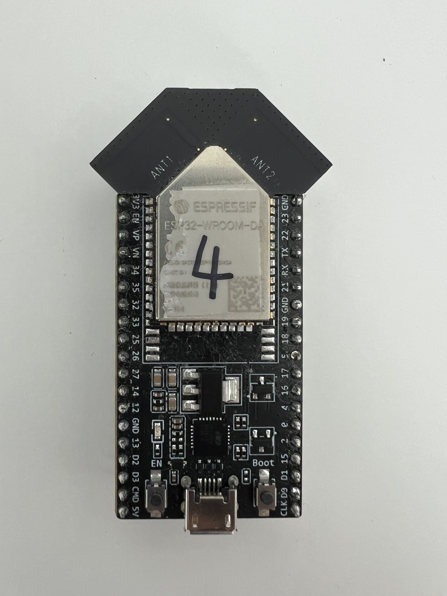
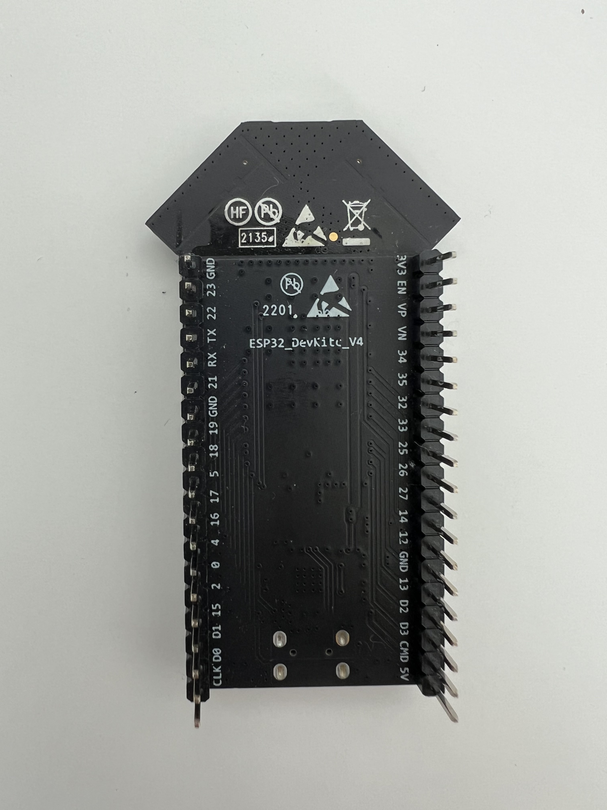

# City-Mesh-Network-of-IoT

This project introduces a state-of-the-art IoT solution for real-time sound monitoring in smart cities. It utilizes ESP32 microcontrollers to create the mesh network for seamless data collection, analysis, and transmission, connecting to cloud services via Raspberry Pi. The system employs an ESP-Now mesh network for robust communication over long distances, crucial for urban IoT applications.

In addition to sound sensor data, the project utilizes advanced signal processing techniques like IIR filtering and the A-Weight algorithm for accurate noise level interpretation. This enables the system to identify sound patterns and extract valuable insights, essential for smart city infrastructure.

However, the project faces challenges due to the newness of ESP-Now technology, impacting adoption and technical support. Integrating diverse communication protocols like ESP-Now, UART, and MQTT adds complexity, requiring careful configuration for stable data flows. Despite these hurdles, the project showcases the potential of ESP32 and Raspberry Pi in long-distance IoT communication, highlighting their scalability and effectiveness in smart city contexts.

### Tools
ESP32-DevKitC-DA ESP32-WROOM-DA Wi-Fi

ICS-43434

## ESP32-Now Mesh network
#### Sound signal collection
#### Transfer sound signal to digital data
## Raspberry Pi
## Cloud API
